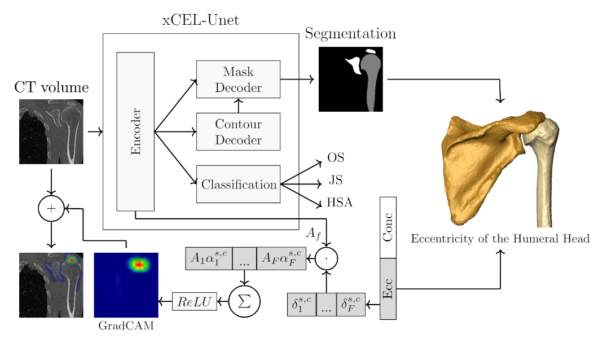

# xCEL_UNEt

This repository shares the code of the ensemble CNN developed for the article **"Context-aware dual-task deep network for concurrent
bone segmentation and clinical assessment to enhance shoulder arthroplasty preoperative planning."**

The repository is organized into two main folders:

- **xCEL_UNet/**: Contains the neural network architecture and utility functions.
  - `__init__.py`: Initialization script for package setup.
  - `cnn.py`: Code for the CNN architecture, including both segmentation and classification module.
  - `utils.py`: Contains helper functions used throughout the codebase.
  
- **images/**: Contains images of the two networks used in the article for illustration purposes.

# xCEL-UNet




## Repository Structure

```bash
.
├── xCEL_UNet
│   ├── __init__.py
│   ├── cnn.py
│   ├── utils.py
│
├── images
│   ├── xCEL_UNet_framework.png
│
├── .gitignore
├── README.md
├── setup.py
    

 
